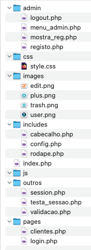

# 🎓 PAP - Plataforma de gestão de Clínica Veterinária

## 👤 Informação do Aluno
**Nome:** Aluno Agrcanelas 
**Número:** 12ºF nº 24  
**Curso:** Profissional de Informática - Sistemas
**Ano Letivo:** 2025/2026 
**Orientador:** Benedita Rosinha

## 📋 Descrição do Projeto
[Descreve brevemente o teu projeto em 2-3 frases. Exemplo:]  
Sistema de gestão de biblioteca online que permite aos utilizadores pesquisar livros, fazer reservas e gerir o seu perfil de leitor.

## 🎯 Objetivos Principais
- [ ] Desenvolver um site dinâmico com base de dados
- [ ] Implementar sistema de autenticação de utilizadores
- [ ] Criar interface responsiva e intuitiva
- [ ] Implementar funcionalidade CRUD completa
- [ ] Fazer deploy da aplicação

## 🛠️ Stack Tecnológica

### **Frontend**
- [ ] HTML5, CSS3, JavaScript
- [ ] Bootstrap/Tailwind CSS [ou outro framework]
- [ ] React/Vue.js [opcional]

### **Backend**
- [ ] Node.js/PHP/Python [escolher um]
- [ ] Express/Laravel/Django [framework]
- [ ] Autenticação JWT/Sessions

### **Base de Dados**
- [ ] MySQL/PostgreSQL
- [ ] ORM: Sequelize/Eloquent [conforme backend]

### **Outras Ferramentas**
- [ ] Git & GitHub
- [ ] Docker [opcional]
- [ ] VSCode

## 📁 Estrutura do Projeto

## 📊 *Funcionalidades Implementadas*

### ✅ Concluídas
- Sistema de registo e login
- Página inicial com listagem
- Perfil de utilizador
...

### 🔄 Em Desenvolvimento
- Funcionalidade de pesquisa
- Upload de ficheiros
...

### 📅 Planeadas
- API REST
- PWA
...

## 🗓️ Plano de Trabalho
Fase	Tarefas	Prazo	Estado
1	Planeamento e setup	DD/MM	✅
2	Desenvolvimento backend	DD/MM	🟡
3	Desenvolvimento frontend	DD/MM	🔴
4	Testes e deploy	DD/MM	🔴

## 📝 Relatório de Progresso
Última Atualização: [Data]
O que foi feito desde a última atualização:
- Implementada a funcionalidade X
- Corrigido bug Y
- Melhorado o design da página Z

## Próximos passos:
- Implementar feature A
- Escrever testes para B
- Otimizar performance C

## 🔗 Links Úteis
- Documentação - Documentação detalhada
- Trello/Planeamento - Quadro de tarefas
- Protótipo - Design no Figma

## 📞 Contacto
- Email: [teu.email@escola.com]
- GitHub: [@teuusername]

